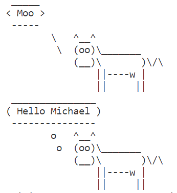

# Exercise: First steps with Node.js and npm

## Task 1: Tools setup

- Install the latest version of [Visual Studio Code](https://code.visualstudio.com/download).
- Install the latest **LTS** version of [Node.js](https://nodejs.org/en/).

- Print the installed versions of VS Code, Git and node.js to the terminal: 

  ```bash
  $ code --version
  $ git --version
  $ node --version
  ```

- Screenshot the terminal outputs to `versions.png`and add the new file to the _staging area_ of the _local_ repository: 

  ```bash 
  $ git add versions.png
  ```

- _Commit_ the staged change (permanently) to the _local_ repository: 

  ```bash
  $ git commit -m "task 1 (stable): screenshot of tool versions"
  ```

- _Push_ (upload) the committed change to the _remote_ repository:

  ```bash
  $ git push
  ```

## Task 2: Create npm project

- Create a new npm project called `hello-node` in your git repository for this classroom assignment, with your github username as author.

- Open the new project folder in VS Code.
  - `File - Open Folder...`
  
- Add a `.gitignore` file which ensures that a future `node_modules` folder wont be pushed to the repository.

- Create a file `app.js`.

- Paste the following statement into `app.js`: 

  ```javascript
  console.log("Hello World");
  ```

- Open the terminal and run your program: 

  ```bash
  $ node app.js
  > Hello World
  ```

- Add a start script to your `package.json` file for running `app.js` with node and test it in the terminal with `npm start` and `npm run start`.

- Take a screenshot of the terminal output and save it as `hello-world.png` in the directory containing the repository.

- Add _all_ new (& modified) files to the staging area:

  ```bash
  $ git add .
  ```

- Commit the staged changes to the local repository: 

  ```bash
  $ git commit -m "task 2 (stable): print hello world"
  ```

- Push the local commits to the remote repository.

The last three steps will be abbreviated as _Add, Commit & Push_ from here on. 
> :bulb: Mind: adding single files vs. adding all files!

## Task 3: Install chalk 

- Use ES modules by adding the module type property to your `package.json`:
    ```json
    "type": "module"
    ```
- Use `npm` to install `chalk` version `4.1.0` in your project. Inspect `package-lock.json` to ensure that exactly `4.1.0` is used.

- Use `chalk` in your `app.js` to output the text "Hello \<your name>" in white on a red background:

    

- Update `package.json` to ensure that only patch versions of `chalk` will be incremented and call `npm update`. Inspect the changes in `package-lock.json` and run `app.js` again.

- Uninstall chalk and re-install to the latest `chalk` version - this should be now anything with `5`upwards! Rerun `app.js` to ensure that everything still works as expected.

- Add, commit and push your changes with commit message `Task 3 (stable): Add and use chalk`.

## Task 4: Install cowsay

- Install the package `cowsay` and ensure in `package.json`, that your project will stick to exactly the current version of `cowsay`.

- Call the `cowsay` executable in the terminal to let it say `Bla`. Create a screenshot from your console and add it as `cowsay-test.png` to your repository.

- Use `cowsay` in your `app.js` to ...
  - ... let it *say* `Moo`
  - ... let it *think* `your name`

  

- Add your changes and commit & push with `Task 4 (stable): using cowsay`
