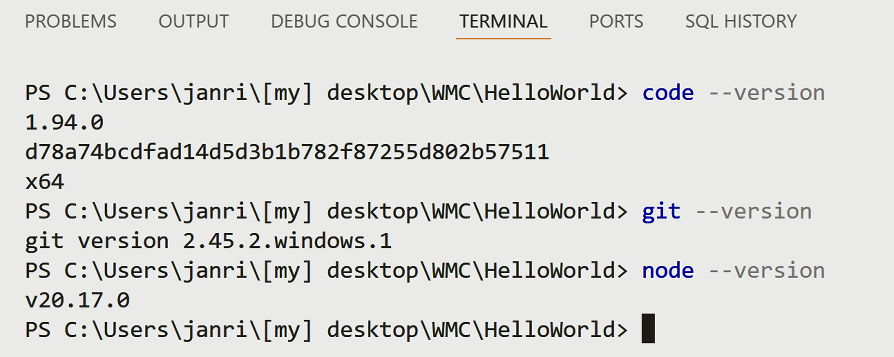
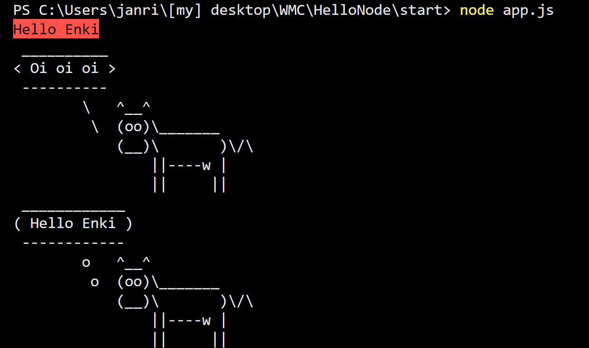

# Protocol  by Jan Ritt   

## First steps with `Node.js` and `npm`  

# *1.* ) Tools *( Versions: )*
  

# *2.* ) CowSay:  

> I followed the steps in the given README.md.
> Don't know what to protocol - after all i did the same things in multiple different ways ... used git via git-commands - which is pretty inconvenient if one knows that all this could be done by a single button-press in Visual Studio, it feels a bit backward to do it in the terminal, with hundreds of commands and without tab-completion or any such "modern" feature.
> even on Linux i would run zsh, zsh-completion, zsh autosuggestion & tab completion, and would have a much nicer experience.  
> I think it is not up to date to look in the help-file or even start up google each time, if it could be done in another way.  
